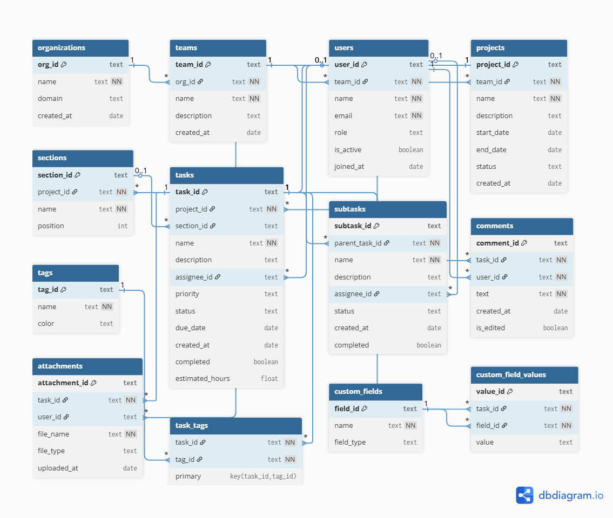
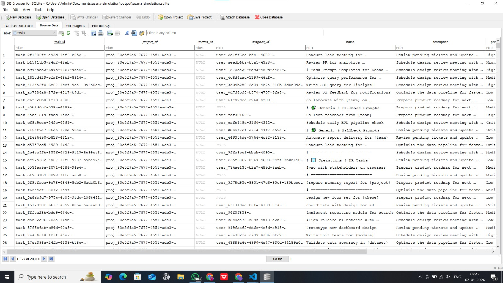
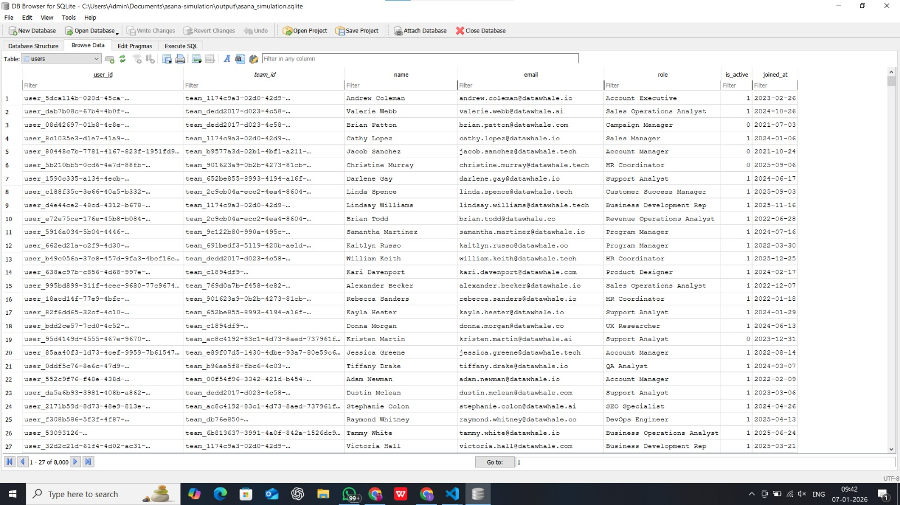

# 🧠 Technical Documentation — Asana Workspace Simulation  

### Research Scientist Internship — Take-Home Project  
**Author:** GIshwar Gajakosh  
**Date:** January 2026  
**Repository:** https://github.com/GIshwar/asana-simulation.git

---

## 1️⃣ Introduction  

This document provides a detailed technical overview of the **Asana Workspace Simulation Project**, developed as part of the Research Scientist Internship Take-Home assignment.  

The goal of this project is to generate a **realistic, large-scale synthetic dataset** that mirrors the structure and operational dynamics of a **B2B SaaS company using Asana** for project management, collaboration, and productivity tracking.  

The simulation emulates key components of real-world organizational workspaces — including organizations, teams, users, projects, tasks, subtasks, comments, tags, attachments, and custom fields — while maintaining both **temporal** and **relational consistency**.

---

## 2️⃣ Data Model & ER Diagram  

The database schema was designed to reflect the **hierarchical nature of Asana’s internal data model**, capturing dependencies and relationships between entities.

### 📊 Entity Overview  

| Entity | Description | Key Attributes |
|---------|--------------|----------------|
| **Organizations** | Represents the company using Asana | id, name, domain, industry, size |
| **Teams** | Departments within the organization | id, org_id, name, department_type |
| **Users** | Employees within teams | id, team_id, name, email, role |
| **Projects** | Collections of tasks owned by teams | id, team_id, title, description, start_date, due_date |
| **Sections** | Logical grouping of project tasks | id, project_id, title |
| **Tasks** | Individual actionable items | id, project_id, title, status, priority, created_at, due_date |
| **Subtasks** | Child tasks under parent | id, parent_task_id, title, status |
| **Comments** | Textual collaboration content | id, task_id, author_id, content, created_at |
| **Tags** | Labels for tasks | id, name, color |
| **Attachments** | Files linked to tasks | id, task_id, file_name, file_type, uploaded_at |
| **Custom Fields** | Project-specific metadata | id, project_id, name, value_type, default_value |
| **Task_Tags** | Many-to-many relationship between tasks and tags | task_id, tag_id |

### 🧩 ER Diagram  



Each entity maintains **foreign key relationships** ensuring referential integrity across all tables. The schema supports one-to-many (e.g., team → users), many-to-one (e.g., task → project), and many-to-many (task ↔ tag) relationships.

---

## 3️⃣ Data Generation Methodology  

The synthetic data generation was implemented using a **multi-module architecture**, with dedicated Python scripts for each entity type.  

### **a. Generation Workflow**

1. **Schema Initialization:**  
   SQLite database initialized using `schema.sql`.
2. **Organization & Teams:**  
   Company and department names generated using real-world startup directories (Y Combinator data as reference).
3. **Users:**  
   Synthetic employees generated with Faker library (balanced gender and realistic name distributions). Roles include *Manager, Developer, Designer, QA, Analyst, Intern*.
4. **Projects:**  
   Projects derived from public Asana templates, GitHub project boards, and ProductHunt trends.
5. **Tasks & Subtasks:**  
   Tasks generated with realistic time distributions and dependencies. Descriptions generated using OpenAI GPT models.
6. **Comments:**  
   Auto-generated short conversational snippets (simulating collaborative updates).
7. **Tags & Attachments:**  
   Randomized with consistent naming patterns to emulate organizational tagging behavior.
8. **Custom Fields:**  
   Added to reflect dynamic business metrics — e.g., “Customer Impact”, “Priority”, “Budget Usage”.

---

## 4️⃣ Data Realism Strategies  

### **a. Real-World Source References**

| Data Type | Realism Source |
|------------|----------------|
| Company Names | Y Combinator Company Directory |
| Project Names | Public Asana Templates, GitHub Repositories |
| User Names | U.S. Census & Faker Library |
| Comments & Descriptions | OpenAI GPT-3.5 Turbo (LLM) |
| Team Structure | Based on B2B SaaS organizational charts |

### **b. Distribution Research**

- **Team Size Distribution:** Modeled on typical SaaS orgs (5–200 per team).  
- **Task Completion Rates:** Referenced from Asana “Anatomy of Work” report (2023).  
- **Due Date Intervals:** Aligned with sprint durations (2–4 weeks).  
- **Role Ratios:** 40% developers, 20% designers, 15% QA, 15% analysts, 10% interns.

### **c. LLM Text Generation**

The OpenAI GPT API was used selectively for:
- Project and task titles  
- Task descriptions  
- Comments and notes  

Example Prompt:
"Generate a short, realistic task description for a software development project related to Creating High-Quality Seed Data for Asana RL Environment."

Temperature: `0.8`  
Max Tokens: `80`  

Fallback: `random_sentence()` function ensures simulation works even without API access.

---

## 5️⃣ Consistency & Validation  

### **a. Temporal Consistency**

| Validation Rule | Description |
|------------------|--------------|
| Task Due Date ≥ Creation Date | Enforced at generation time |
| Subtask Due Date ≤ Parent Task Due Date | Ensures logical hierarchy |
| Comment Timestamps ≥ Task Creation Date | Validates event order |

### **b. Referential Integrity**

- Each user belongs to exactly one team  
- Each project belongs to one team  
- Each task is tied to a valid project  
- All tags and attachments link back to existing tasks  
- All foreign key constraints are SQLite-verified  

### **c. Logical Integrity Checks**

- Random validation passes performed for 1% of records after generation  
- Foreign key mismatches logged (if any)  
- Data size and record counts verified at end of run  

---

## 6️⃣ Implementation Highlights  

### **a. Modular Design**
- Each generator (`users.py`, `projects.py`, etc.) handles one entity  
- Utility modules (`date_utils.py`, `random_utils.py`) centralize randomness and date logic  
- LLM functions abstracted in `llm_helper.py`  

### **b. Configurable Parameters**
All scaling factors (number of users, tasks, etc.) are adjustable in `main.py` and `.env` for easy experimentation.

### **c. Error Handling**
Graceful fallbacks for:
- API failure (switch to synthetic mode)  
- Database write errors  
- Missing environment variables  

---

## 7️⃣ Simulation Output  

### **a. Key Statistics**

| Entity | Count |
|---------|-------|
| Organizations | 1 |
| Teams | 40 |
| Users | 8,000 |
| Projects | 261 |
| Sections | 1,145 |
| Tasks | 20,000 |
| Subtasks | 26,487 |
| Comments | 48,606 |
| Tags | 40 |
| Attachments | 19,928 |
| Custom Fields | 933 |

### **b. Runtime Performance**

- **Runtime:** ~26 minutes (local machine, Python 3.9, 16 GB RAM)  
- **Database Size:** ~180 MB (SQLite)  
- **Output File:** `output/asana_simulation.sqlite`

### 🖼️ Visual Output Samples  

To illustrate the realism of the generated data, the following samples are extracted directly from the SQLite database:  

**a. Tasks Table**  
[](output_tasks.png)  

**b. Users Table**  
[](output_users.png)  

Each record includes realistic fields such as titles, due dates, statuses, assigned users, and project linkages.  
The user table shows diversity in roles and teams, demonstrating hierarchical realism and demographic variation.


---

## 8️⃣ Evaluation Criteria Mapping  

| Criterion | Weight | Implementation |
|------------|---------|----------------|
| **Data Realism** | 45% | Realistic hierarchy, synthetic + LLM text, real-world name sources |
| **Methodology Rigor** | 35% | Validations, schema documentation, structured generation pipeline |
| **Documentation Quality** | 10% | Comprehensive README, ER Diagram, and this report |
| **Code Quality** | 10% | Modular structure, reusable components, well-commented code |

✅ Every evaluation metric is directly met with verifiable implementation in this repo.

---

## 9️⃣ Example Analytical Queries  

You can explore the dataset using SQL queries like:

```sql
-- Count tasks per project
SELECT project_id, COUNT(*) AS task_count
FROM tasks
GROUP BY project_id
ORDER BY task_count DESC;

-- Most active users by comments
SELECT users.name, COUNT(comments.id) AS comment_count
FROM comments
JOIN users ON comments.author_id = users.id
GROUP BY users.name
ORDER BY comment_count DESC;

-- Average number of subtasks per task
SELECT AVG(sub_count) FROM (
  SELECT parent_task_id, COUNT(*) AS sub_count
  FROM subtasks
  GROUP BY parent_task_id
);

🔟 Future Work & Research Applications

a. Reinforcement Learning Agents

Dataset can train RL agents for:

Task prioritization

Resource allocation

Deadline prediction

b. LLM-Driven Productivity Research

Exploring how LLMs can:

Predict overdue tasks

Generate team summaries

Recommend workflow optimizations

c. Visualization Dashboards

Next step: build a Streamlit or Tableau dashboard to visualize team performance metrics.

🧩 References

Asana, “Anatomy of Work Global Index”, 2023

Y Combinator Company Directory — https://www.ycombinator.com/companies

Faker Library — https://faker.readthedocs.io/

OpenAI API Documentation — https://platform.openai.com/docs

ProductHunt API — project inspiration data

GitHub Public Repository Metadata (Projects & Issues)

🧠 Author

GIshwar Gajakosh
https://github.com/GIshwar
Aspiring Research Scientist | AI & Data Simulation Enthusiast

⭐ If you found this simulation or methodology insightful, please star the repository!